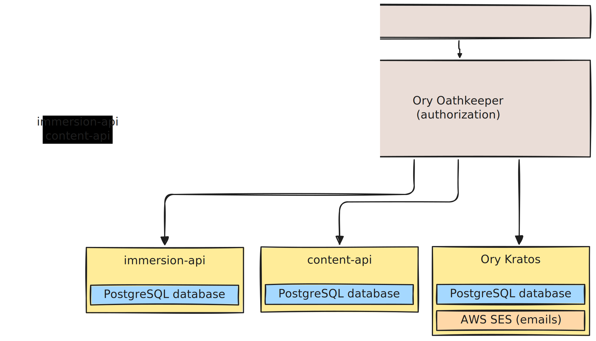

# Tadoku Architecture

## Overview

The Tadoku app consists of several backend services & frontends deployed to a Kubernetes cluster. For development we use [Tilt](https://tilt.dev/) to spin up a [local environment](/local_environment.md) which mimics the production deployment.

### Backend services

- [immersion-api](/services/immersion-api.md)
- [content-api](/services/content-api.md)
- [Ory Kratos](https://github.com/ory/kratos)

### Frontends

- [webv2](/frontend/webv2.md)
- [auth](/frontend/auth.md)

### Infrastructure

- [Kong gateway](https://docs.konghq.com/gateway/latest/): ingress for all Traffic into the Kubernetes cluster
- [Ory Oathkeeper](https://github.com/ory/oathkeeper): identity & access proxy responsible for authorizing http traffic to the APIs.

## System Diagram

