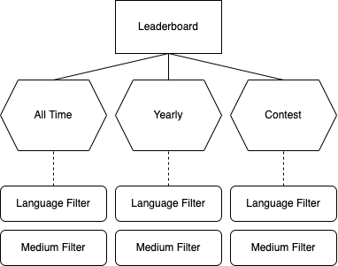

# [001] Leaderboard Improvements

* Status: proposed
* Author: @antonve
* Date: 2022-04-23

## Context

As of now the leaderboard has limitations that prevents us from delivering a better UX. We're limited to just one variation of a leaderboard, without the ability to filter or change the start and/or end date of a leaderboard.
We'd like to introduce global and yearly leaderboards, together with the ability to filter on language and/or media. The current design where we precalculate the rankings does not work given these constraints. 
We also have no way of knowing a user's position in the leaderboard without fetching the complete leaderboard. It would be nice if we could show the current position on a user's profile page.
Global and yearly leaderboards could get fairly large, so ideally we would be able to paginate the leaderboard.

### Use cases



## Considered options

### PostgreSQL without precalculations

We could get rid of the materialized leaderboards in the database all-together. This allows us to add filters, or generate leaderboards over different timespans.

An example query to fetch a leaderboard could look like this:

```sql
with ranks as (
  select user_id, sum(weighted_score) as score
  from contest_logs
  where
    -- we can change these conditions on the fly to get a different variation
    contest_id = 9 and
    language_code = 'jpn'
  group by user_id
)

select r.*, u.display_name
from ranks as r
inner join users as u on (u.id = r.user_id)
order by r.score desc
```

#### Pros

* Simple design
* Flexible enough so we can add more filters if we wish to do so

#### Cons

* Unable to get a user's position in a leaderboard without fetching the complete leaderboard
* Pagination with a design like this is hard on the database (for global/yearly leaderboards)

### Redis Ordered Sets

Leaderboard implementations for large scale usually use some sort of ordered set under the hood. This is an efficient data structure that can quickly find a given element in an ordered set, and can quickly fetch the elements above and under it.

Ref. https://redis.io/docs/manual/data-types/#sorted-sets

These can be used to drive our leaderboards as well. One issue with an ordered set approach is that you can't apply any filters to it, so we'd have to find a way around that. If we want to support the following variations of a leaderboard:

* 1 unfiltered
* ~15 language filter
* 8 media filter
* 120 language * media filter

This means we'd need 144 ordered sets per time frame we want to support. That'd mean we'd need 6,624 ordered sets to support our desired use cases for only 5 years worth of contests. This seems a bit excessive considering we also need to update each relevant ordered set when we update the leaderboard.

To reduce the amount of ordered sets to maintain we can do the following:
* Only use ordered sets for hot paths:
  * Global leaderboard: with each language and media filter, no combined language + media
  * Yearly leaderboard: with each language and media filter, no combined language + media
  * Contest leaderboard: no variations
* As fallback we can use the PostgreSQL approach mentioned above
  * In this case we'd most likely want to limit the amount of users shown so that we don't need to paginate
* Global and yearly learderboards will have limited filtering

This brings our total number of ordered sets down to 174 to support 5 years worth of leaderboards. This is much more managable.
Updating our leaderboards would look something like this:

```
# postgres
insert into contest_logs (
    user_id,
    contest_id,
    year,
    language_code,
    medium_id,
    raw_score,
    weighted_score
) ...

# redis
zadd contests:global weighted_score user_id
zadd contests:global:lang_jp weighted_score user_id
zadd contests:global:medium_0 weighted_score user_id

zadd contests:year_2022 weighted_score user_id
zadd contests:year_2022:lang_jp weighted_score user_id
zadd contests:year_2022:medium_0 weighted_score user_id

zadd contests:id_2 weighted_score user_id
```

Some other changes we'd have to make in order to support this:
* Add weighted score to contest logs
* Add year to contest logs
* Add indexes on score and weight score
* Fetch usernames separately from the leaderboard
  * This is something that was coming with changes we want to make to user storage regardless

#### Pros

* Fast fetching of the leaderboard
* Scales to a large amount of participants in a single leaderboard
* Supports filtering and multiple time-frames
* Supports fetching a user's position in the leaderboard

#### Cons

* The filtering is limited, we wouldn't be able to filter on both language and medium for global/yearly leaderboards
* Complexity is significantly higher than what we have now
  * We'd have to make sure Redis and PostgreSQL stay in sync
* Not suitable in case we want to grow the amount of filters
* We currently don't have Redis running in production

## Decision

Option 2 seems to be most aligned with the use cases we want to implement for this project. It also splits some of the coupling we have between the leaderboard and user metadata fetching, which is something we'd need to do anyway.
This design also seems to lay the foundation for private contests between users and richer user profiles. The complexity involved would be worth the speed gains and freedom to add extra functionality in the future.

## Outcome

To be written after implementation
