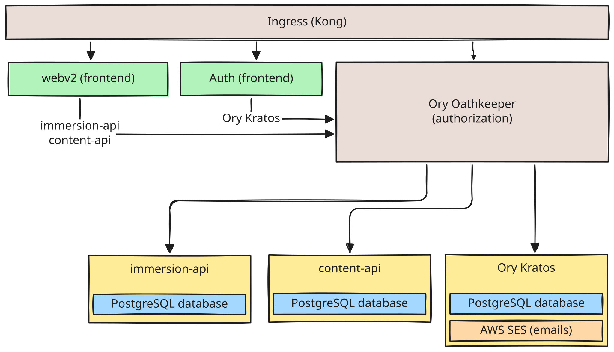

# Tadoku Architecture

## Overview

The Tadoku app consists of several backend services & frontends deployed to a Kubernetes cluster. For development we use [Tilt](https://tilt.dev/) to spin up a [development environment](./local-environment.md) which mimics the production deployment.

### Backend services

- [immersion-api](./services/immersion-api.md)
- [tadoku-api](https://github.com/tadoku/tadoku/tree/main/services/tadoku-api), including the public [Content API](./services/content-api.md) namespace
- [Ory Kratos](https://github.com/ory/kratos)

### Frontends

- [webv2](./frontend/webv2.md)
- [auth](./frontend/auth.md)

### Infrastructure

- [Kong gateway](https://docs.konghq.com/gateway/latest/): ingress for all Traffic into the Kubernetes cluster
- [Ory Oathkeeper](https://github.com/ory/oathkeeper): identity & access proxy responsible for authorizing http traffic to the APIs.

## Historical system diagram

This diagram predates the consolidation of Content API routes into Tadoku API.

