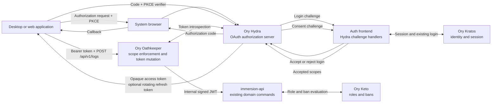

# Tadoku third-party delegated access implementation plan

Status: proposed

Last updated: 2026-08-08

Related research: [HTML architecture report](third-party-delegated-access-report.html) · [Presentr copy](https://presentr.lab/html/tadoku-third-party-oauth-architecture)

## Overview

Add standards-based delegated access so third-party applications can act for a Tadoku user without receiving the user's password or Kratos session cookie. The first supported use case is an installed desktop reading tracker that publishes reading or listening logs in the background.

The implementation adds Ory Hydra alongside the existing Ory Kratos, Oathkeeper, and Keto services:

- **Kratos** continues to authenticate people and own identity traits.
- **Hydra** becomes the OAuth 2.0 authorization server: clients, authorization grants, consent, access and refresh tokens, introspection, and revocation.
- **Oathkeeper** validates external OAuth access tokens, enforces scopes and audience, and converts successful requests into the internal signed JWT format already consumed by the Go services.
- **Keto and domain services** continue to enforce bans, roles, ownership, and business rules.

Before starting this plan, upgrade the Ory stack to the latest stable, mutually supported releases. Pin the selected application and Helm chart versions in the repository, follow each component's upgrade and migration documentation, and review all current security advisories. This plan intentionally does not prescribe version numbers because they will be selected during that prerequisite upgrade.

## Product and protocol terminology

### Background access versus `offline_access`

Use **Background access** as the Tadoku product term.

Keep **`offline_access`** as the OAuth/OIDC scope identifier sent on the wire. It is the interoperable name understood by OAuth client libraries and Hydra for requesting refresh-token-based access. Renaming the protocol scope to a custom identifier would make integrations less predictable and could require custom token-issuance behavior.

`offline_access` does **not** grant another Tadoku API operation. It changes the lifetime of an already approved grant:

- `logs:write` means the application may create logs for the authenticated Tadoku user.
- `offline_access` means the application may receive a refresh token and retain the approved scopes when the user is no longer actively using Tadoku.
- A desktop application with no network connection still cannot call Tadoku. It queues activity locally and synchronizes when connectivity returns.

Never show the raw identifier as the primary user-facing copy. Use wording such as:

> **Background access**
>
> Keep this application connected so it can publish later, even when Tadoku is closed.

Developer documentation should make the mapping explicit:

> Request the `offline_access` scope to enable Background access and receive a refresh token.

### Initial scope vocabulary

| Protocol scope | User-facing permission | Initial status |
| --- | --- | --- |
| `logs:write` | Create reading and listening logs | Launch scope |
| `offline_access` | Background access | Launch scope; optional and separately explained |
| `logs:read` | Read your log history | Deferred |
| `profile:read` | Read basic Tadoku profile information | Deferred |
| `openid` | Sign in with Tadoku | Deferred; not required for delegated log publishing |

Do not add a generic `api`, `write`, wildcard, or all-access scope.

## Chosen direction

1. Use OAuth 2.0 Authorization Code with PKCE S256 for all user-delegated clients.
2. Treat installed desktop and mobile applications as **public clients**. They receive no client secret.
3. Use the user's external/system browser for authorization. Never collect Tadoku credentials in an embedded application webview.
4. Use opaque Hydra access tokens externally and Hydra token introspection at Oathkeeper.
5. Keep external access tokens short-lived. Use rotating refresh tokens only when `offline_access` was explicitly approved.
6. Expose a narrow, versioned public API beginning with `POST /api/v1/logs`; do not expose the existing internal wildcard routes to third-party bearer tokens.
7. Derive the user ID exclusively from the validated token subject. Never accept a caller-supplied user ID for a self-service write.
8. Normalize successful OAuth authentication into an Oathkeeper-signed internal JWT so existing service verification remains the trust boundary.
9. Build Hydra login, consent, logout, and error challenge handlers into the existing auth frontend and reuse the existing Kratos login experience.
10. Start with manually provisioned pilot clients, then provide authenticated self-service client registration for normal scopes.

## Non-goals for the initial release

- Acting as a general-purpose “Sign in with Tadoku” OpenID Connect provider.
- Supporting client credentials or other machine-to-machine grants through this public integration surface.
- Open, unauthenticated dynamic client registration.
- Exposing all existing internal APIs.
- Personal access tokens as a replacement for OAuth.
- Device Authorization Grant, browser-only SPA clients, or mobile-specific SDKs.
- Adding read access to private logs or profile fields.
- Storing mutable Kratos identity traits in long-lived OAuth grants.

## Architecture



### Trust boundaries

| Boundary | Required behavior |
| --- | --- |
| Third-party client → Hydra | Standards-based authorization; PKCE; exact registered redirect; no Tadoku password handling |
| Third-party client → public API | Opaque bearer token; TLS; stable versioned contract |
| Oathkeeper → Hydra | Cluster-private authenticated introspection; issuer, audience, active-state, expiry, and scope validation |
| Oathkeeper → Go service | Short-lived signed internal JWT using the existing Oathkeeper key trust |
| Go service → domain | Stable user subject plus credential metadata; no trust in caller-provided ownership fields |
| Domain → Kratos/Keto/storage | Server-side authoritative identity lookup and existing authorization/business rules |

## Client models

### Installed desktop application

The developer registers the desktop product once. All installations may share its public `client_id`; the identifier is not a secret. Each installation obtains a separate user grant and refresh-token family.

Required flow:

1. Generate a high-entropy PKCE verifier, S256 challenge, and transaction-specific `state`.
2. Start the selected callback mechanism.
3. Open the Hydra authorization URL in the system browser.
4. Let Tadoku/Kratos authenticate the user and show consent.
5. Validate `state` when the authorization code returns.
6. Exchange the code and PKCE verifier without a client secret.
7. Keep access tokens short-lived and store refresh tokens in the operating-system credential store.
8. Queue activity locally while offline and synchronize only after connectivity returns.

Preferred callback order:

1. Claimed HTTPS redirect when the platform and application distribution make it practical.
2. RFC 8252 loopback IP redirect bound only to `127.0.0.1` on an ephemeral port.
3. Reverse-domain custom URI scheme when the other options are unavailable.

The selected Hydra release and client-registration implementation must be integration-tested against the callback pattern, including ephemeral loopback ports. A loopback listener must accept one callback, validate the transaction, and close immediately.

### Confidential server-side web application

Register an exact HTTPS callback and issue a client secret or stronger client authentication suitable for a server that can protect credentials. Still require Authorization Code with PKCE. Store tokens only on the server, never in browser storage.

### Client registration experience

OAuth requires a unique `client_id` so Tadoku can:

- bind exact redirect URIs;
- identify the application on the consent screen and in audit logs;
- apply per-client scope policy and rate limits;
- revoke or disable one application without affecting others; and
- show meaningful entries in Connected Apps.

Registration does not need to be an email or manual approval queue:

- **Pilot:** administrators provision one or two clients through Hydra's supported administrative tooling.
- **General availability:** an authenticated “Create application” page provisions normal clients through a Tadoku backend that calls Hydra's private admin API.
- **Sensitive expansion:** new high-impact scopes can require review without delaying ordinary `logs:write` clients.
- **Future automation:** protected dynamic client registration may be added if deployment platforms need it. Completely open registration remains out of scope.

Minimum registration fields:

- application name;
- application type: native/public or confidential web;
- exact redirect URI list;
- developer or organization identity;
- homepage, privacy policy, and support URL;
- requested scopes from Tadoku's allowlist; and
- optional logo subject to safe media handling and review.

## Token and identity model

### External tokens

- Access tokens are opaque and short-lived.
- Refresh tokens are opaque, rotating, and issued only for Background access.
- Refresh-token reuse detection and family revocation are enabled.
- Clients treat all token values as opaque and never rely on their internal shape.
- Access and refresh tokens are never accepted in URL query parameters.

Exact lifetimes are operational configuration selected during implementation. Begin with conservative short access-token lifetimes and bounded idle and absolute refresh/grant lifetimes, then adjust using pilot evidence.

### Internal JWT

After successful introspection, Oathkeeper mints the internal JWT forwarded to the API. It should contain only the claims needed by downstream authentication, authorization, and auditing:

- `sub`: Kratos identity UUID supplied to Hydra during login acceptance;
- `type`: `user`;
- `credential_source`: `oauth_access_token`;
- OAuth client identifier;
- granted scopes;
- target service audience;
- internal issuer and normal registered time claims; and
- a request/correlation identifier where supported.

Do not copy the complete Kratos session or mutable profile traits into the OAuth grant or internal JWT.

### Profile synchronization correction

The current log-create path calls `UserUpsert` and can update `display_name` from authentication claims using the gateway JWT issue time. A delegated OAuth identity will not carry an authoritative current Kratos session. Before accepting OAuth writes:

- represent credential source explicitly in the common identity model;
- write a failing regression test showing a delegated request cannot blank or replace a current display name;
- prevent OAuth-derived authentication claims from updating mutable profile fields;
- replace per-write profile mutation with a narrow ensure/synchronization path;
- when a user row is absent, resolve the current display name through the existing server-side Kratos client before creating it; and
- move continuing profile synchronization toward an explicit account/profile lifecycle rather than every log write.

The stable Kratos UUID is the OAuth subject and ownership key. Kratos remains the source of truth for mutable identity traits.

## Public API boundary

Launch with one external contract:

```http
POST /api/v1/logs
Authorization: Bearer <opaque-access-token>
Content-Type: application/json
```

Reuse the existing log-create request semantics and domain command, but document the endpoint in a public OpenAPI contract using bearer security rather than the internal cookie scheme.

The Oathkeeper rule must:

- match the exact public host, path, and `POST` method;
- accept only Hydra OAuth token introspection for authentication;
- have no `anonymous` fallback;
- require `logs:write` using exact scope matching;
- validate the configured Hydra issuer and Tadoku API audience;
- reject inactive, expired, revoked, wrong-client, wrong-audience, or insufficient-scope tokens;
- mint the internal JWT described above; and
- strip the public prefix before forwarding to the existing upstream route.

The handler/domain must continue to derive `userID` from the authenticated subject and apply existing validation, registration, contest, scoring, and banned-user rules.

## Auth and account user experience

Self-hosted Hydra is headless. Add the following routes to the existing auth frontend rather than creating another identity application:

### Login challenge handler

- Receive and validate Hydra's login challenge.
- Read the current Kratos session server-side.
- If authenticated, accept the login challenge using the Kratos identity UUID as the subject.
- If signed out or step-up authentication is required, route through the existing Kratos login/MFA experience and resume the challenge safely.
- Never expose the Hydra admin API or its credentials to browser JavaScript.

This route is usually an adapter rather than a new visible login page.

### Consent screen

Show:

- verified application name and developer;
- requested permissions in plain language;
- a distinct Background access row when `offline_access` is requested;
- privacy policy, homepage, and support links;
- whether the application was previously approved;
- Approve and Deny actions with equal clarity; and
- an explanation that access can be revoked later.

Only accept scopes both requested by the client and selected/allowed by policy. Never add a scope silently.

Use the existing `ui` package components and button classes. Any form state must use `react-hook-form` with the shared form components.

### Logout and protocol errors

- Handle Hydra logout challenges and return users to a safe Tadoku destination.
- Render invalid, expired, denied, and interrupted challenge states without exposing internal details.
- Prevent open redirects by using Hydra-returned verified redirect destinations and Tadoku allowlists.

### Connected Apps

Add an authenticated Tadoku account page that lists:

- application name and developer;
- granted scopes using product-facing labels;
- granted date and last-used time when available;
- Background access status;
- installation/session information when it can be represented reliably; and
- a Revoke action.

Revocation must invalidate the relevant Hydra grant/token family without requiring contact with the third party. Account deletion, banning policy where applicable, and client disablement must also revoke relevant grants.

## Benefits

- Third-party applications never receive Tadoku passwords or Kratos session cookies.
- Users grant narrow, understandable permissions to an identifiable application.
- Connections are revocable per application.
- Desktop applications can synchronize safely across restarts and intermittent connectivity.
- The existing Oathkeeper → internal JWT → Go middleware boundary remains intact.
- New scopes and public endpoints can be added deliberately without exposing internal wildcard APIs.
- OAuth client libraries can integrate using standard discovery, PKCE, refresh, introspection, and revocation behavior.

## Risks and mitigations

| Risk | Mitigation |
| --- | --- |
| Consent phishing or misleading application metadata | Authenticated developer ownership, validated redirect URIs and links, clear Tadoku-hosted consent, client disablement, and abuse reporting |
| Authorization-code interception in native applications | System browser, PKCE S256, transaction-specific state, claimed HTTPS or correctly bound loopback callback |
| Extracted desktop client secret | Native clients are public and receive no secret |
| Stolen refresh token | OS credential storage, rotation, reuse detection, bounded lifetimes, family revocation, and Connected Apps |
| Background access misunderstood as additional data access | Keep `offline_access` only on the wire; display “Background access” separately from action scopes |
| Scope bypass through broad internal routing | Exact public Oathkeeper rules, no anonymous fallback, required scope/audience checks, and negative integration tests |
| Stale OAuth claims overwrite profile data | Stable subject-only delegated identity and authoritative server-side Kratos synchronization |
| Introspection latency or availability | Keep Hydra highly available, instrument latency/errors, use safe timeouts; evaluate only short, correctly keyed caching after launch evidence |
| Revocation weakened by caching | Disable introspection caching initially or bound it to a documented short maximum with revocation-latency tests |
| Tokens or codes leak into logs | Header/query redaction, no tokens in URLs, structured audit events containing client/subject/scope but not credentials |
| Hydra admin API exposure | Cluster-private service, network policy, server-side callers only, least-privilege credentials |
| Upgrade incompatibility across Ory components | Complete and validate the latest-stable Ory upgrade before feature work; pin the verified set |
| Refresh rotation broken by desktop crashes or concurrent refreshes | Atomic credential replacement, one refresh operation per grant, bounded server grace behavior, and crash/concurrency tests |

## Measurable success criteria

- A pilot desktop application connects through the system browser without rendering or receiving a Tadoku password.
- The desktop client is configured as a public client and completes Authorization Code + PKCE without a client secret.
- A token with `logs:write` can create a log for its subject through `POST /api/v1/logs`.
- Tokens missing `logs:write`, with the wrong audience/issuer, expired, or revoked never reach the log-create handler.
- A user can grant Background access, restart the desktop application, refresh when online, and publish queued activity.
- A user can decline Background access and still complete a short-lived `logs:write` connection without receiving a refresh token.
- Revoking the application prevents the next uncached API request and prevents further refresh.
- Delegated writes cannot create, blank, or stale-overwrite a user's display name.
- Existing cookie-session users and service-to-service callers continue to pass their current authentication and authorization tests.
- Banned users remain blocked through the existing middleware/domain pipeline.
- Access tokens, refresh tokens, authorization codes, client secrets, and PKCE verifiers are absent from application, gateway, and tracing logs in automated verification.
- The public OpenAPI contract, developer guide, consent copy, and Connected Apps labels consistently call `offline_access` “Background access.”
- End-to-end tests cover approve, deny, refresh, revoke, expired challenge, invalid redirect, wrong scope, and native callback failure paths.

## Delivery strategy and parallel work

The phases below are ordered by gates. Within a phase, workstreams explicitly marked **parallel** can be assigned independently after their phase prerequisites are satisfied.

Any Tadoku schema or data migration discovered during implementation must be a standalone commit and pull request, deployed before dependent code. Hydra's own schema upgrade/migration job is also deployed independently before feature code depends on that Hydra deployment.

## Phase 0 — Upgrade and establish the security baseline

Goal: begin feature work on a current, pinned, mutually supported Ory stack with an agreed protocol profile.

- [ ] Inventory the deployed Kratos, Oathkeeper, Keto, Helm chart, database, and SDK versions in every environment.
- [ ] Select the latest stable, mutually supported Ory component and chart releases available at implementation time.
- [ ] Review current release notes, upgrade guides, migrations, deprecations, and security advisories for every selected component.
- [ ] Upgrade one Ory component/change set at a time using independent, atomic changes where practical.
- [ ] Run required component migrations before rolling out dependent versions.
- [ ] Pin the verified component/chart versions in repository configuration; do not leave production behavior dependent on a floating latest tag.
- [ ] Validate existing Kratos login, logout, MFA, cookie-session authentication, Oathkeeper JWT mutation, Keto roles/bans, and service-to-service authentication.
- [ ] Record the selected Tadoku OAuth issuer, public API audience, public hostnames, private admin service names, and TLS expectations in an ADR.
- [ ] Record Authorization Code + PKCE S256, opaque external tokens, introspection, and exact-scope matching as the supported profile.
- [ ] Choose the first desktop callback pattern and document the fallback order.
- [ ] Define the initial scope registry and product-label mapping, including `offline_access` → Background access.
- [ ] Define initial token/grant lifetimes as environment configuration, without hard-coding them in application code.

**Gate 0:** all current authentication flows pass on the upgraded, pinned Ory stack; the ADR, scope registry, issuer/audience, callback policy, and token profile are approved. No Hydra feature implementation begins before this gate.

## Phase 1 — Deploy Hydra as independent infrastructure

Goal: provide a production-shaped Hydra authorization server with private administration and no dependent Tadoku behavior yet.

- [ ] Add a Hydra database and database user to the existing Zalando Postgres development resource and equivalent environment provisioning.
- [ ] Add managed secrets for Hydra system/crypto configuration and database access.
- [ ] Add a standalone Hydra migration job/change using the selected release's supported migration command.
- [ ] Deploy and verify migrations independently before deploying Hydra runtime pods.
- [ ] Add Hydra public and admin Kubernetes services with explicit separation.
- [ ] Expose only the public authorization, token, revocation, user-facing logout, JWKS, and discovery endpoints through TLS.
- [ ] Keep the admin API cluster-private and restrict it with network policy and least-privilege callers.
- [ ] Configure stable issuer and public URLs; verify generated discovery metadata contains the intended external endpoints.
- [ ] Configure login, consent, logout, and error destinations pointing at placeholder/non-enabled auth frontend routes until Phase 2.
- [ ] Configure opaque access tokens, refresh rotation/reuse policy, and environment-driven lifetimes.
- [ ] Add health, readiness, metrics, structured logs, secret redaction, backup, and restore coverage.
- [ ] Add Hydra to the `k8s/dev/` Tilt stack using ignored local host configuration and committed placeholder examples.
- [ ] Document environment configuration, migration order, key rotation, backup/restore, and emergency client/grant revocation.

**Gate 1:** Hydra is healthy in development/staging, discovery is correct, the admin API is not externally reachable, migration and restore procedures are proven, and no existing Tadoku flow regresses.

## Phase 2 — Parallel foundations

After Gate 1, the following three workstreams can proceed in parallel.

### Workstream 2A — Auth frontend challenge handlers

- [ ] Add server-side Hydra admin SDK/client configuration to the auth frontend without exposing credentials to the browser bundle.
- [ ] Implement the login challenge handler using the current Kratos session.
- [ ] Reuse the existing Kratos login/MFA flow when no sufficient session exists and safely resume the Hydra challenge.
- [ ] Implement the consent screen with application metadata, scope labels, Background access copy, Approve, and Deny.
- [ ] Use `react-hook-form` and shared `ui` form components for any consent/form state.
- [ ] Implement logout challenge and protocol-error routes.
- [ ] Reject missing, expired, replayed, malformed, or mismatched challenges safely.
- [ ] Validate redirect destinations and prevent open redirects.
- [ ] Add frontend tests for signed-in fast path, signed-out return, step-up authentication, approval, denial, Background access copy, expired challenges, and API failures.
- [ ] Add browser-level integration tests against real development Kratos and Hydra instances.

### Workstream 2B — Common identity and profile boundary

- [ ] Write a failing backend test demonstrating that delegated authentication with no profile traits can overwrite or blank `display_name` through the current `UserUpsert` path.
- [ ] Extend the common identity model with an explicit credential source while preserving narrow consumer interfaces.
- [ ] Extend internal JWT parsing for OAuth client ID and granted scopes needed for auditing/defense-in-depth.
- [ ] Introduce a narrow user ensure/profile synchronization interface in the domain package; do not import storage from domain.
- [ ] Ensure a missing immersion user is created from an authoritative server-side Kratos identity lookup.
- [ ] Prevent OAuth authentication metadata from updating mutable profile fields.
- [ ] Preserve existing first-party behavior while moving recurring profile updates out of per-log mutation where possible.
- [ ] Use injected `commondomain.Clock` for any new time-dependent behavior.
- [ ] Add Testify coverage for cookie users, OAuth users, missing users, changed display names, Kratos failure, invalid subject, and concurrent requests.
- [ ] Run Gazelle if imports or files change and validate affected Bazel targets.

### Workstream 2C — Client and developer contract

- [ ] Define a versioned client-registration request model and validation rules.
- [ ] Define public versus confidential client policies and allowed grant/response types.
- [ ] Define redirect rules for HTTPS, loopback IP, and reverse-domain custom schemes.
- [ ] Define per-client allowed-scope policy; disallow wildcard scopes.
- [ ] Define safe client metadata fields and rendering rules for consent.
- [ ] Create one manually provisioned native/public pilot client with no secret.
- [ ] Build a minimal reference desktop client or test harness that uses system-browser Authorization Code + PKCE.
- [ ] Implement OS credential storage abstraction in the reference client and avoid plain-file token persistence.
- [ ] Test local offline queuing and later online synchronization behavior at the client level.
- [ ] Document atomic refresh-token replacement and single-flight refresh behavior.

**Gate 2:** the auth frontend completes a real approve/deny flow; the reference native client receives tokens without a secret; delegated identity cannot corrupt profile data; and all three workstreams have automated tests.

## Phase 3 — Add the scoped public log-write API

Goal: allow the pilot client to create a Tadoku log through one narrow external endpoint.

- [ ] Add the versioned `POST /api/v1/logs` operation to a public OpenAPI specification with bearer authentication.
- [ ] Reuse the existing log-create schema where appropriate while documenting public error responses and idempotency expectations.
- [ ] Regenerate OpenAPI code using the repository workflow and keep the complete generated diff.
- [ ] Add an exact Oathkeeper access rule for the public host, path, and `POST` method.
- [ ] Configure Hydra introspection using private service connectivity and required credentials where applicable.
- [ ] Require exact `logs:write`, the configured issuer, and Tadoku API audience.
- [ ] Do not configure an anonymous or cookie fallback on the public OAuth route.
- [ ] Map introspection results into the internal JWT subject, credential source, client ID, scopes, and target audience.
- [ ] Forward to the existing immersion log-create handler/domain command after public-prefix stripping.
- [ ] Add handler and middleware tests for valid token, missing token, inactive token, expired token, revoked token, wrong issuer, wrong audience, missing scope, and malformed introspection response.
- [ ] Add domain regression tests proving the token subject owns the created log and a body/query user ID cannot override ownership.
- [ ] Verify existing contest registration, validation, scoring, tag normalization, user-ban, and service-audience behavior remains active.
- [ ] Add gateway/API rate limits keyed by client and subject with safe defaults.
- [ ] Add structured audit events containing client ID, subject, scopes, route, outcome, and correlation ID but no credential values.
- [ ] Keep introspection caching disabled for the pilot unless a bounded configuration is explicitly approved and revocation latency is tested.

**Gate 3:** the pilot native client creates a log end to end; every negative token/scope case is blocked before domain execution; profile and existing authentication regressions pass; and revocation blocks the next uncached request.

## Phase 4 — Connected Apps and operational revocation

Goal: give users and operators complete visibility and control before onboarding external developers.

### Parallel workstream 4A — User experience

- [ ] Add a Connected Apps route to the authenticated Tadoku account area.
- [ ] List active applications, developer identity, granted permissions, Background access, grant date, and last use where available.
- [ ] Render raw OAuth scope identifiers only in optional developer detail, not as primary copy.
- [ ] Add a confirmation flow and Revoke action using shared `ui` components.
- [ ] Handle loading, empty, error, already-revoked, and partial-Hydra-failure states.
- [ ] Verify keyboard, screen-reader, and mobile behavior.

### Parallel workstream 4B — Revocation and lifecycle services

- [ ] Add narrow server-side Hydra interfaces for listing and revoking the current user's grants.
- [ ] Derive the user exclusively from the authenticated session; never accept an arbitrary subject from the browser.
- [ ] Revoke the correct token/grant family and make repeated revocation idempotent.
- [ ] Integrate OAuth grant revocation into account deletion.
- [ ] Define and implement the policy for banned users and existing grants.
- [ ] Add operator client-disable and all-grants revoke procedures.
- [ ] Add Testify coverage for ownership, missing grant, Hydra errors, repeated revoke, deletion, ban policy, and disabled clients.

### Parallel workstream 4C — Observability and incident readiness

- [ ] Dashboard authorization starts, approvals, denials, code exchanges, refreshes, introspection outcomes, public API calls, and revocations.
- [ ] Alert on abnormal token failures, refresh reuse, introspection failure rate, consent spikes, and per-client abuse.
- [ ] Verify all logs/traces redact authorization codes, access/refresh tokens, client secrets, and PKCE verifiers.
- [ ] Write runbooks for client compromise, user token theft, Hydra outage, key compromise, and emergency global revocation.
- [ ] Exercise backup/restore and revocation behavior in staging.

**Gate 4:** users can inspect and revoke their own applications; account/client lifecycle revokes access; incident signals and runbooks exist; and credential-redaction verification passes.

## Phase 5 — Self-service developer registration

Goal: remove the manual-registration bottleneck without allowing anonymous client creation.

- [ ] Add an authenticated developer-applications area.
- [ ] Build the client form with `react-hook-form` and `ui` package controls.
- [ ] Validate exact redirect URIs and client-type-specific rules on the server.
- [ ] Allow only approved initial scopes and grant types.
- [ ] Create/update/disable clients through a narrow backend Hydra admin interface.
- [ ] Display a client secret only for confidential clients, only at creation/rotation time, with secure handling guidance.
- [ ] Never issue a secret to a native/public client.
- [ ] Add ownership checks and an audit trail for all client changes.
- [ ] Add per-developer and per-client quotas/rate limits.
- [ ] Add application metadata preview matching the eventual consent presentation.
- [ ] Add operator review/disable controls for abuse without making ordinary creation approval-bound.
- [ ] Add tests for native/confidential policies, redirect attacks, unauthorized edits, unsafe URLs, wildcard scopes, secret handling, and client disablement.

**Gate 5:** an authenticated developer can create a safe normal-scope client without staff intervention; unsafe registrations are rejected; and users see accurate client identity during consent.

## Phase 6 — Desktop pilot and controlled launch

Goal: prove the intended installed-application experience before expanding scopes or client types.

- [ ] Select one pilot desktop integration and confirm its distribution/ownership identity.
- [ ] Complete native client registration with the approved callback pattern and no client secret.
- [ ] Test Windows, macOS, and Linux callback behavior where supported by the pilot.
- [ ] Test system-browser authorization with an existing session, signed-out session, MFA, denial, and canceled browser flow.
- [ ] Test Background access across app restart, Tadoku browser logout, network loss, refresh, and later synchronization.
- [ ] Test refresh concurrency, application crash during rotation, stale token recovery, revocation, and reauthorization.
- [ ] Test OS credential storage and uninstall/reinstall expectations.
- [ ] Measure authorization completion, refresh success, introspection latency/failure, API success, and revocation latency.
- [ ] Publish a developer guide, discovery URL, scope guide, native-app sample, error reference, and security requirements.
- [ ] Conduct security review and abuse/privacy review.
- [ ] Roll out to a small user cohort, observe, and set evidence-based rate/token settings before broader availability.

**Gate 6:** all measurable success criteria pass for the pilot; security and privacy reviews approve launch; operational metrics are healthy; and support/revocation procedures are exercised.

## Verification commands

Run the checks relevant to each change, plus targeted integration tests against the development Ory stack.

Frontend:

```sh
cd frontend && pnpm --filter webv2 exec tsc --noEmit
cd frontend && pnpm --filter webv2 lint
cd frontend && pnpm build
```

Backend:

```sh
bazel build //services/...
bazel test //services/...
gofmt -w services/
bazel run //:gazelle
```

After SQL query changes:

```sh
./scripts/generate-sqlc.sh
```

After OpenAPI changes:

```sh
cd services/immersion-api/http/rest/openapi && go generate
cd services/content-api/http/rest/openapi && go generate
```

Add an end-to-end suite that boots or targets the development Kratos/Hydra/Oathkeeper path and verifies authorization, consent, code exchange, refresh, introspection, public API enforcement, and revocation as one flow.

## Follow-up improvements enabled by this work

- Add `logs:read` with separate consent and carefully bounded private-history endpoints.
- Add `profile:read` with a minimal stable userinfo contract that excludes email by default.
- Offer “Sign in with Tadoku” through OpenID Connect only when a real identity-provider use case exists.
- Add Device Authorization Grant for command-line tools or devices without a practical local browser callback.
- Add protected dynamic client registration for approved deployment ecosystems.
- Add sender-constrained access tokens such as DPoP if the threat model and client ecosystem justify the complexity.
- Add per-installation names and selective device/grant revocation if Hydra metadata and product UX can represent them reliably.
- Add an integration activity history so users can see what each application published.
- Add application verification badges or a public integration directory after developer self-service is established.
- Split high-risk future permissions into fine-grained scopes and require step-up authentication or review.

## Decisions to preserve

- `offline_access` remains the protocol scope; **Background access** is the Tadoku product term.
- A desktop application is a public client and never receives a client secret.
- Developers register an application once; individual users authorize it but do not register it.
- Self-service registration is the target developer experience; manual provisioning is only the pilot bootstrap.
- OAuth access is normalized at Oathkeeper rather than teaching every service to validate Hydra token formats.
- Kratos UUID is the stable user subject; mutable profile data remains authoritative in Kratos.
- The first release is one write scope and one public endpoint.
- The Ory stack is upgraded and pinned to the latest stable compatible set before implementation; this plan intentionally contains no fixed version numbers.
