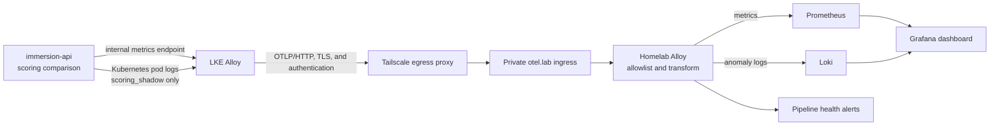

# Scoring shadow observability and parity dashboard

Status: approved for implementation

Date: 10 August 2026

Scope: production scoring-engine migration telemetry from LKE to homelab-prod

## Overview

Instrument every eligible legacy-versus-engine scoring comparison, export the
migration's metrics and anomaly logs from the production LKE cluster over a
private authenticated connection, and provision a durable Grafana dashboard in
homelab-prod.

Use two complementary signals:

- A bounded Prometheus counter is the source of truth for complete match,
  mismatch, unmatched, and error totals.
- Structured Loki events provide diagnostic detail for anomalies only.

Do not derive matching totals from application logs. The current shadow path
logs only failures, unmatched inputs, and mismatches, so successful matches are
silent. Logging every successful comparison would also create unnecessary log
volume.

The target data path is:



Grafana is not an ingestion target. LKE sends telemetry to Alloy; Grafana
queries Prometheus and Loki inside homelab-prod.

## Current state and gaps

| Area | Current behavior | Required behavior |
| --- | --- | --- |
| Scoring comparison | `LogCreate` and `LogUpdate` run shadow evaluation while the scoring-engine feature flag is off | Observe every comparison exactly once in shadow and authoritative burn-in modes |
| Matches | Successful matches emit no signal | Increment a counter with `outcome="match"` |
| Anomalies | `RecordPlatformScoringShadow` emits several human-readable `slog` messages | Emit one stable, sanitized structured event schema |
| Durability | Production pod logs are ephemeral and LKE has no migration telemetry collector | Deploy a narrowly scoped LKE collector with queues, retries, and health telemetry |
| Homelab ingest | Homelab Alloy accepts metrics and traces; Loki exists but the OTLP route does not accept logs | Accept the approved logs and metrics, enforce exact allowlists, and export logs to Loki |
| Dashboard | No scoring migration dashboard exists | Provision Grafana dashboard JSON and alerts through GitOps |

The existing implementation is therefore useful as a diagnostic warning but is
not yet sufficient evidence for a production cutover.

## Terminology and counting semantics

Dashboard panels should say **scoring evaluations**, not unique logs.

A single application log can be evaluated when it is created and again when it
is updated. The primary counter measures scoring comparisons by operation. It
does not attempt to deduplicate comparisons into unique domain logs.

The four outcomes are mutually exclusive:

| Outcome | Definition |
| --- | --- |
| `match` | The legacy and engine scores are equal under the agreed comparison precision |
| `mismatch` | Both scorers produced a score, but the values differ |
| `unmatched` | The engine produced no applicable scoring rule for an otherwise eligible input |
| `error` | The engine evaluation could not be completed |

## Signal contract

### Parity counter

Add this counter:

```text
tadoku_scoring_shadow_comparisons_total{
  outcome="match|mismatch|unmatched|error",
  operation="create|update",
  mode="shadow|authoritative",
  activity_id="1|2|3|4|5",
  score_source="amount|duration_minutes"
}
```

Add this gauge:

```text
tadoku_scoring_engine_enabled 0|1
```

The counter labels are intentionally bounded. Do not add language, unit key,
rule-set identifiers, rule identifiers, request identifiers, user identifiers,
or arbitrary error types as metric labels.

### Structured anomaly event

Only `mismatch`, `unmatched`, and `error` outcomes need log events. Use a
constant event name:

```text
event=scoring_shadow
```

Approved diagnostic fields:

- `outcome`
- `operation`
- `mode`
- `activity_id`
- `unit_key`
- `language_code`
- `score_source`
- `legacy_score`
- `engine_score`
- `absolute_delta`
- `relative_delta`
- `rule_set_id`
- bounded applied rule identifiers
- sanitized `error_type`
- optional opaque correlation identifier

Prohibited fields:

- user, registration, or application-log identifiers
- tags, descriptions, or other user-authored content
- URIs, headers, request bodies, or authentication data
- raw database errors or arbitrary exception strings
- unbounded objects or collections

Keep only low-cardinality fields as Loki stream labels:

- cluster
- environment
- namespace
- service
- event
- outcome

Unit, language, scores, rules, deltas, and correlation identifiers remain in
the JSON body or Loki structured metadata.

### Resource attributes

LKE Alloy should attach at least:

```text
service.name=immersion-api
service.namespace=tdk-prod-immersion-api
deployment.environment.name=production
k8s.cluster.name=lke-prod
service.version=<deployed image or revision>
```

## Repository ownership

| Repository | Required changes |
| --- | --- |
| `tadoku` | Observer interface and implementation, counter and gauge, structured anomaly schema, internal metrics listener, and tests |
| `tadoku-argocd` | Application metrics Service/configuration, LKE Alloy deployment and RBAC, Tailscale egress resources, network policy, CA mount, and securely provisioned credentials |
| `antonve-homelab` | Private OTLP ingress and authentication, Alloy logs pipeline and allowlists, Loki mapping, Prometheus resource promotion, Grafana dashboard, alerts, canary, and validation updates |

Database schema changes are not required for the initial observability rollout.
If durable per-comparison audit history becomes a product requirement, design
and ship that separately; Loki is operational telemetry, not the source of
truth for domain data.

## Dashboard specification

### Variables

- cluster
- environment
- operation
- mode
- activity
- score source

### Panels

1. **Matching scoring evaluations**
2. **Non-matching scoring evaluations**, combining mismatch, unmatched, and
   error
3. **Parity percentage**
4. **Scoring engine feature-flag status**
5. **Comparisons by outcome over time**
6. **Breakdown by operation, activity, score source, and mode**
7. **Anomaly details from Loki**, including the approved safe diagnostic
   fields
8. **Comparison throughput and last telemetry received**
9. **Alloy accepted/refused records and metric points**
10. **Exporter failures and queue utilization**

Add deployment and feature-flag annotations where practical.

### Representative PromQL

Matching evaluations in the selected range:

```promql
sum(
  increase(
    tadoku_scoring_shadow_comparisons_total{
      outcome="match",
      k8s_cluster_name="$cluster"
    }[$__range]
  )
)
```

Non-matching evaluations:

```promql
sum(
  increase(
    tadoku_scoring_shadow_comparisons_total{
      outcome=~"mismatch|unmatched|error",
      k8s_cluster_name="$cluster"
    }[$__range]
  )
)
```

Parity percentage:

```promql
100 *
sum(increase(tadoku_scoring_shadow_comparisons_total{outcome="match"}[$__range]))
/
clamp_min(sum(increase(tadoku_scoring_shadow_comparisons_total[$__range])), 1)
```

The final queries must include the dashboard's environment, operation, mode,
activity, and score-source variable filters consistently.

### Representative LogQL

The final label names depend on the approved Alloy-to-Loki mapping, but the
query should follow this form:

```logql
{k8s_cluster_name="$cluster", service_name="immersion-api", event_name="scoring_shadow"}
  | json
  | outcome!="match"
```

The anomaly table should display outcome, operation, mode, activity, unit,
language, score source, legacy score, engine score, deltas, rule information,
sanitized error type, and correlation identifier.

## Benefits and risks

Benefits:

- Complete match and non-match totals without high-volume success logs.
- Detailed anomaly investigation without high-cardinality Prometheus labels.
- Continued evidence during authoritative burn-in after the feature flag is
  enabled.
- A reusable private OTLP transport between the clusters.
- Pipeline-health panels prevent missing telemetry from looking like perfect
  parity.

Risks and mitigations:

| Risk | Impact | Mitigation |
| --- | --- | --- |
| The cross-cluster receiver becomes a security boundary | High | Tailscale ACL, TLS, endpoint authentication, narrow ingress, least-privilege network policy, and credential rotation |
| Sensitive or high-cardinality data reaches Prometheus or Loki | High | Application privacy tests, fail-closed Alloy allowlists, low-cardinality labels, and a forbidden-attribute canary |
| A pipeline outage produces false confidence | High | Comparison-throughput, last-seen, refusal, exporter, and queue alerts on the dashboard |
| A refactor double-counts evaluations | Medium | One observer call per comparison and exact-increment tests for every branch |
| Collector retry duplicates anomaly events | Medium | Treat metric totals as the parity source of truth; use logs for diagnosis rather than counting |
| Seven-day Loki retention is shorter than the parity window | Medium | Keep the initial window within retention or expand Loki storage and retention before starting it |
| A shared tailnet ingress permits access to other virtual hosts | High | Use endpoint authentication and the narrowest practical ACL; prefer a dedicated Tailscale service endpoint if isolation cannot be demonstrated |

## Phase 0: define the parity gate and privacy contract

- [ ] Confirm that `match`, `mismatch`, `unmatched`, and `error` are mutually
      exclusive.
- [ ] Define the score comparison precision and rounding behavior.
- [ ] Define how unmatched inputs are classified and whether any known cases
      are acceptable.
- [ ] Approve the bounded metric labels.
- [ ] Approve the structured-event field allowlist and prohibited-field list.
- [ ] Set the minimum comparison volume and observation window. Initial target:
      at least 10,000 eligible comparisons over at least seven consecutive
      days.
- [ ] Set the engine activation threshold. Initial target: zero unexplained
      mismatches or errors, every unmatched case classified, and a healthy
      telemetry pipeline throughout the window.

Gate: maintainers approve the parity semantics, activation criteria, and data
handling contract.

## Phase 1: instrument Tadoku

- [ ] Define a narrow `ScoringShadowObserver` interface where it is consumed;
      the domain package must not import an observability or storage package.
- [ ] Refactor create and update scoring so the engine is evaluated exactly
      once per eligible operation.
- [ ] Record exactly one mutually exclusive outcome for every eligible
      comparison.
- [ ] Preserve current shadow behavior while the feature flag is off: use the
      interim score for the write and observe the engine result.
- [ ] Keep comparison observation active during authoritative burn-in while
      the feature flag is on and the legacy scorer remains available.
- [ ] When the engine errors in shadow mode, record `error` and continue with
      the legacy score.
- [ ] When the engine errors in authoritative mode, record `error` before
      returning the existing rejection behavior.
- [ ] Implement `tadoku_scoring_shadow_comparisons_total` and
      `tadoku_scoring_engine_enabled`.
- [ ] Replace the current anomaly messages with the stable, sanitized
      `scoring_shadow` event schema.
- [ ] Expose Prometheus metrics on a dedicated internal-only port and Service,
      not through the public application ingress.
- [ ] Add backend tests for every outcome and both flag modes.
- [ ] Test that each eligible operation increments exactly once and that the
      engine is not evaluated twice.
- [ ] Test the metric label set and ensure values are bounded.
- [ ] Test the anomaly event's required and prohibited fields.
- [ ] Test the metrics endpoint lifecycle and graceful shutdown behavior.
- [ ] Run the required Bazel build and test targets and format changed Go code.

Gate: Bazel build and tests pass, local scraping proves one counter increment
per test comparison, and privacy tests prove prohibited fields are absent.

## Phase 2: establish secure LKE-to-homelab transport

This phase can run in parallel with Phase 1 after Phase 0 passes.

Do not commit Tailscale OAuth credentials, OTLP authentication credentials, or
other secrets into Git. Establish Sealed Secrets or External Secrets in LKE,
or provision Kubernetes Secrets out of band with an explicit rotation process,
before deploying the transport.

- [ ] Install a pinned Tailscale Kubernetes Operator in LKE.
- [ ] Provision its OAuth credentials through the approved secret-management
      path.
- [ ] Create a two-replica egress ProxyGroup for availability.
- [ ] Add an annotated ExternalName Service that resolves the homelab OTLP
      endpoint through that proxy group.
- [ ] Add a dedicated `otel.lab` HTTPS ingress in homelab-prod that routes only
      OTLP/HTTP to Alloy.
- [ ] Mount the Lab CA in the LKE collector and validate the endpoint using
      `otel.lab` as the TLS server name and HTTP host.
- [ ] Require application-layer authentication in addition to tailnet access.
- [ ] Restrict tailnet ACLs to the narrowest practical LKE-to-homelab OTLP
      flow.
- [ ] Add Kubernetes network policies for DNS/API access, the application
      metrics target, the egress proxy, the ingress proxy, and Alloy.
- [ ] Test valid authentication and certificate validation.
- [ ] Test that missing credentials, incorrect credentials, invalid TLS, and
      disallowed tailnet identities are rejected.
- [ ] Test egress availability while one proxy replica is unavailable.

Gate: an authenticated synthetic OTLP request crosses the clusters,
unauthenticated and unauthorized requests fail, and no OTLP receiver is
publicly exposed.

## Phase 3: collect only migration telemetry in LKE

This phase depends on the Phase 1 signal contract and Phase 2 transport.

- [ ] Deploy a pinned Grafana Alloy release in LKE with the required RBAC and
      at least two replicas.
- [ ] Discover only the immersion-api metrics Service and dedicated metrics
      port.
- [ ] Scrape and retain only `tadoku_scoring_*` application metrics.
- [ ] Bridge the Prometheus scrape to the Alloy OTLP pipeline.
- [ ] Tail only the production immersion-api namespace and application
      container through the Kubernetes API.
- [ ] Parse JSON and drop every log event except `event=scoring_shadow`.
- [ ] Bridge the selected log events to the Alloy OTLP pipeline.
- [ ] Add the approved service, environment, cluster, and version resource
      attributes.
- [ ] Send metrics and logs through the authenticated OTLP/HTTP exporter.
- [ ] Configure bounded retries and queues, using durable queueing if the
      selected pinned Alloy components support it safely.
- [ ] Expose Alloy self-metrics for receiver, processor, queue, and exporter
      health.
- [ ] Verify that unrelated application logs and metrics are dropped before
      cross-cluster export.

Gate: synthetic match metrics and mismatch events reach homelab, unrelated
application telemetry does not, and a forced receiver interruption produces
bounded recovery or a visible data-loss alert.

## Phase 4: extend the homelab observability pipeline

This phase can begin in parallel with Phases 1 and 2 using synthetic signals.

- [ ] Enable logs in the existing Alloy OTLP receiver, memory limiter,
      transform, and batch chain.
- [ ] Extend the fail-closed resource and log-record allowlists with only the
      approved scoring fields and `k8s.cluster.name`.
- [ ] Reject or remove every field that is not explicitly allowed.
- [ ] Route OTLP logs through the Loki exporter/write path.
- [ ] Keep detailed diagnostic fields out of Loki stream labels.
- [ ] Promote `k8s.cluster.name` into Prometheus labels alongside the existing
      service and environment attributes.
- [ ] Extend network policies for ingress-proxy-to-Alloy and Alloy-to-Loki
      traffic.
- [ ] Update the monitoring validation script for this exact private,
      authenticated ingress while preserving the prohibition on generic public
      receiver exposure.
- [ ] Extend the canary with one safe scoring anomaly event.
- [ ] Include a forbidden sentinel attribute in the canary and prove that it
      does not reach Loki.
- [ ] Add alerts for refused log records, refused metric points, exporter
      failures, queue pressure, and missing migration telemetry.
- [ ] Exercise each new alert path with synthetic or intentionally blocked
      traffic.

Gate: direct Prometheus and Loki queries return the synthetic signals,
forbidden attributes are absent, and all pipeline-health alert paths have been
exercised.

## Phase 5: provision the Grafana dashboard and run the parity window

- [ ] Add the scoring-shadow dashboard JSON to the homelab Grafana dashboard
      provisioning package.
- [ ] Add the cluster, environment, operation, mode, activity, and score-source
      variables.
- [ ] Add all headline, trend, breakdown, anomaly, and pipeline-health panels
      from the dashboard specification.
- [ ] Add alerts for any mismatch or error during the parity gate.
- [ ] Add an unmatched warning that requires explicit classification.
- [ ] Add missing-traffic and pipeline-health alerts.
- [ ] Add release and feature-flag annotations where practical.
- [ ] Validate every panel against direct PromQL or LogQL over a fixed time
      range with known synthetic inputs.
- [ ] Start the agreed observation window only after application and telemetry
      health gates pass.
- [ ] Classify and resolve every non-match before enabling the engine.
- [ ] Record the final comparison volume, window, outcome totals, deployment
      versions, and sign-off decision.

Gate: dashboard totals equal raw queries, all anomalies are explained or
resolved, the minimum comparison volume and window are met, and telemetry
remained healthy for the full window.

## Parallel work lanes

| Lane | Can start after | Work |
| --- | --- | --- |
| Application | Phase 0 gate | Observer, metrics endpoint, structured events, and tests |
| Connectivity | Phase 0 gate | LKE secret management, Tailscale operator/proxy, private ingress, CA, authentication, and ACLs |
| Homelab pipeline | Phase 0 gate | Alloy log branch, allowlists, Loki mapping, Prometheus cluster label, canary, and alerts |
| Dashboard | Signal contract approval | Dashboard JSON and direct-query fixtures using synthetic metrics and logs |

The application, connectivity, homelab pipeline, and initial dashboard work can
therefore proceed independently after the Phase 0 contract is fixed. End-to-end
validation still requires all lanes to converge before Phase 5.

## Measurable success criteria

- Every eligible create or update comparison increments exactly one outcome
  counter.
- Dashboard counts equal direct PromQL results for the same fixed time range.
- Every anomaly row contains the approved diagnostic fields and no prohibited
  fields.
- Unrelated LKE logs and metrics are absent from the homelab migration streams.
- Unauthenticated OTLP requests fail, while the authenticated private route
  survives one egress-proxy replica loss.
- Pipeline refusal, exporter failure, queue pressure, and missing-traffic tests
  trigger visible alerts.
- The cutover window contains at least the agreed number of eligible
  comparisons over the agreed consecutive duration.
- Before activation, there are zero unexplained mismatches or errors and every
  unmatched case is classified.
- Observation continues during an authoritative burn-in window before the
  legacy scoring bridge is removed.

## Atomic delivery

Application changes should be split into reviewable commits:

1. Observer contract and exact-once comparison behavior with tests.
2. Prometheus metrics and internal listener with tests.
3. Structured anomaly schema and privacy tests.

Infrastructure changes should remain repository-specific:

1. LKE secret-management prerequisite and Tailscale transport.
2. LKE Alloy collection and filtering.
3. Homelab OTLP authentication and Alloy logs pipeline.
4. Homelab dashboard, canary, and alerts.

Any future database migration must be delivered as its own standalone commit
and pull request, deployed before dependent application code, according to the
repository migration policy.

## Rollback

- Turning off or removing the LKE collector stops export without changing
  scoring behavior.
- Reverting the homelab OTLP route and logs branch removes external ingestion
  without affecting existing local Prometheus, Loki, or Tempo consumers.
- The application observer must be non-authoritative: a telemetry failure must
  not reject a log or alter its selected score.
- Feature-flag rollback remains independent from telemetry rollback.
- Keep the dashboard and historical telemetry through the investigation and
  burn-in period unless retention or privacy requirements require earlier
  deletion.

## Follow-up improvements

- Generate an automated feature-flag readiness report from the parity metrics.
- Add release annotations and compare parity by application version.
- After a stable authoritative burn-in, remove the legacy scorer and retire
  shadow-specific telemetry deliberately.
- Reuse the private OTLP transport for other narrowly approved services with a
  separate data contract and ownership review.
- If audit-level history becomes necessary, design a durable domain audit store
  rather than extending Loki into a source-of-truth system.

## Reference documentation

- [Prometheus OTLP receiver guidance](https://prometheus.io/docs/guides/opentelemetry/)
- [Grafana Alloy Prometheus receiver](https://grafana.com/docs/alloy/latest/reference/components/otelcol/otelcol.receiver.prometheus/)
- [Grafana Alloy Loki receiver](https://grafana.com/docs/alloy/latest/reference/components/otelcol/otelcol.receiver.loki/)
- [Grafana Alloy OTLP/HTTP exporter](https://grafana.com/docs/alloy/latest/reference/components/otelcol/otelcol.exporter.otlphttp/)
- [Loki HTTP API](https://grafana.com/docs/loki/latest/reference/loki-http-api/)
- [Loki structured metadata](https://grafana.com/docs/loki/latest/get-started/labels/structured-metadata/)
- [Tailscale Kubernetes operator egress](https://tailscale.com/docs/kubernetes-operator/egress)
- [Grafana dashboard variables](https://grafana.com/docs/grafana/latest/visualizations/dashboards/variables/)
