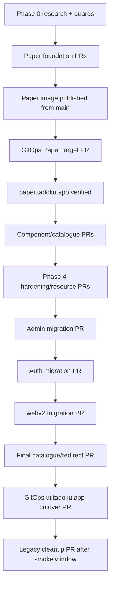

# Tadoku Paper CI gaps, PR boundaries, and ownership

Status: Phase 0 delivery contract

## Finding

The current frontend workflows are production builders, not pull-request gates. Each of admin, auth, legacy styleguide, and webv2 has a separate workflow triggered by scheduled runs and path-filtered pushes. The build job runs only `pnpm install` plus `next build`; it does not run on pull requests, use `--frozen-lockfile`, explicitly lint/typecheck/test, or build the container before merge. A second job rebuilds from scratch on `main` and pushes `latest`, full Git SHA, and `prod`.

The `prod` push is effectively a deployment trigger because Image Updater writes its resolved digest to the separate GitOps repository and Argo CD auto-syncs. Therefore the last safe gate is before the Tadoku PR merge, not after image publication.

## Repository-setting evidence

| Repository | Observed rule | Gap |
| --- | --- | --- |
| `tadoku/tadoku` | Active ruleset requires one PR approval and prevents deletion/non-fast-forward changes | Main has zero required status-check contexts; admins can bypass. A red/missing Paper job does not technically block merge. |
| `antonve/tadoku-argocd` | Private; one listed admin; no branch protection/ruleset | `Validate manifests` runs on PR and main but is not required. A merge deploys automatically. |

Before autonomous Paper merges begin, add the fast Paper job as a required check for matching PRs or treat its successful run as an explicit manual gate in every PR record. Production GitOps PRs must not merge until `Validate manifests` passes even though settings do not enforce it.

## Current workflow gaps

| Gap | Risk | Required correction |
| --- | --- | --- |
| No frontend `pull_request` trigger | Broken code can be reviewed/merged before its first CI build | Paper workflow runs on PR and main; migrated application workflows gain PR checks. |
| Build only, no explicit lint/typecheck/tests | Next build is not the full contract and Paper is Vite/package-based | Run boundary, lint, typecheck, package tests, catalogue tests, and builds explicitly. |
| `pnpm install` lacks `--frozen-lockfile` | CI may accept a lockfile drift that production builds differently | Use `pnpm install --frozen-lockfile`. |
| PR does not build production image | Docker/static-server mistakes first appear after merge | Build the exact Paper Dockerfile on PR without login/push. |
| Publish job rebuilds independently of tested artifacts | Tested output and pushed output can diverge through nondeterminism | Build once where practical; at minimum repeat every deterministic quality gate in the image build and record the source SHA/digest. |
| Shared Next-only `frontend/Dockerfile` | Cannot copy Vite `dist`; changing it risks four existing images | Add an app-local Paper static Dockerfile; leave shared Next image unchanged. |
| Paper paths absent from every workflow | Package/app changes can receive no relevant check | Add dedicated Paper workflow and phase-aware application path filters. |
| Root workspace paths incompletely watched | `frontend/package.json` or `pnpm-workspace.yaml` changes may skip app builds | Add root package/workspace/config inputs to applicable filters. |
| Legacy `ui` package tests not run by frontend workflows | Shared behavior can regress while all builds pass | Preserve tests during coexistence and run Paper tests independently. |
| No concurrency/timeout policy | Superseded PR builds consume capacity; stuck builds delay promotion | Add PR concurrency cancellation and explicit job timeouts. Never cancel an in-progress main publication after tag mutation begins. |
| Mutable `latest`/`prod` are emphasized | Operators may record a tag rather than deployment identity | Gate/report the immutable registry digest and source SHA. |
| No required status checks in repository settings | Workflow definition alone cannot enforce merge gate | Add required check contexts after names stabilize, or record an explicit non-bypass gate. |
| GitOps validator uses hard-coded root/app/updater lists | A syntactically valid Paper root can still be omitted or policy can fail unexpectedly | Update all three lists in the same GitOps PR and run `make validate`. |
| No delivery smoke job | SPA fallback/cache/health defects are invisible to package tests | Run the production container and assert direct routes, content types, cache headers, and missing assets. |

Action versions in current frontend workflows span `actions/checkout@v3/v4`, `actions/setup-node@v3`, `pnpm/action-setup@v2`, and `actions/cache@v3`. Updating/pinning them is useful hardening but should be a separate mechanical PR from the Paper behavior unless an old action blocks the workflow.

## Paper workflow contract

Suggested required job names are stable because branch protection refers to them:

| Job | Events | Commands / proof |
| --- | --- | --- |
| `paper / boundaries` | PR, main | Run repository migration/boundary guard; reject private imports, mixed systems, Next/Headless in Paper, and duplicate stylesheet imports. |
| `paper / quality` | PR, main | Frozen install; `paper-ui` typecheck, test, build, pack/export smoke; `paper-styleguide` lint, test, `tsc --noEmit`, build. |
| `paper / static image` | PR, main | Build exact production image; start non-root container; check health, root, direct nested route, hashed asset/cache, missing asset `404`, and compressed response. No push on PR. |
| `paper / publish` | main only, after all above | Push full SHA and `prod` (plus `latest` if retained); emit image digest and source SHA in job summary. Explicit `packages: write`. |

Use `paths` covering at least:

```text
frontend/apps/paper-styleguide/**
frontend/packages/paper-ui/**
frontend/scripts/check-paper-boundaries.mjs
frontend/paper-boundaries.json
frontend/package.json
frontend/pnpm-workspace.yaml
frontend/pnpm-lock.yaml
frontend/.npmrc
frontend/.dockerignore
.github/workflows/build-frontend-paper-styleguide.yaml
```

If Docker/static-server sources live elsewhere, include them explicitly. Workflow changes must trigger their own workflow.

## Phase-aware compatibility matrix

| Change path / state | Paper | Legacy styleguide | Admin | Auth | webv2 |
| --- | ---: | ---: | ---: | ---: | ---: |
| `paper-ui/**`, before any app migration | required | no | no | no | no |
| `paper-styleguide/**` | required | no | no | no | no |
| Legacy `ui/**` during coexistence | no | required | required | required | required |
| `paper-ui/**` after admin cutover | required | no | required | no | no |
| `paper-ui/**` after auth cutover | required | no | required | required | no |
| `paper-ui/**` after webv2 cutover | required | no | required | required | required |
| Workspace lockfile/root build config | required | required while present | required | required | required |
| Phase 8 clean repository | required | removed | required | required | required |

“Required” means lint, explicit typecheck, production build, and production image build for an application; Paper additionally runs its package/catalogue tests. Update path filters in the same PR that flips an application's migration marker so there is no interval where it consumes Paper without watching Paper.

## PR boundaries and dependency order

Schema/database migrations are absent from this program. Keep application and GitOps changes separate because the repositories deploy through different mechanisms.



Recommended atomic boundaries:

1. **Research/guard PR:** documents and automated coexistence checks only; no production component.
2. **Package foundation PRs:** small `paper-ui` contracts/tests by component/foundation ownership. One integrator owns public exports, tokens, and registry aggregation.
3. **Paper app/delivery PR:** Vite shell, app-local static image, Paper workflow, and Tilt integration. It may merge only after the Paper jobs pass; merging publishes the first image.
4. **Initial GitOps Paper PR:** new namespace/root/Application/Ingress/certificate/updater admission pinned to the already-published digest. Do not reference a nonexistent image.
5. **Vertical/component PRs:** code, deterministic fixtures, documentation, and tests remain one logical slice. Main publications may auto-update only the independent Paper hostname.
6. **Static hardening/resource PRs:** Tadoku server-config changes and GitOps resource/probe changes are separate, ordered PRs. Deploy endpoint/config capability before enabling a probe that depends on it.
7. **One migration PR per application:** composed of atomic commits but deployable as one image; update its workflow and migration marker in the same PR. No unrelated product behavior.
8. **Final Paper route/redirect PR:** prove every old bookmark at `paper.tadoku.app` before host cutover.
9. **Final GitOps UI cutover PR:** pause the legacy updater mapping and roll the existing UI Deployment to the verified Paper digest. Keep Service/Ingress/TLS/DNS unchanged.
10. **Cleanup PRs:** only after smoke window; remove legacy app/package/workflow and later retire or redirect the Paper alias.

The Paper image publication PR and initial GitOps deployment PR cannot be merged as one cross-repository unit: the immutable digest must exist before GitOps can validate and deploy it.

## Ownership map

| Responsibility | Logical owner | Merge authority / dependency |
| --- | --- | --- |
| Token names, public exports, catalogue registry | Paper integrator | Tadoku PR; sole shared-contract editor during parallel work |
| Component slice | Category owner | Tadoku PR with implementation, fixture, doc, and tests together |
| Vite/static server/Tilt | Paper delivery owner | Tadoku PR |
| Paper workflow and path matrix | Paper CI owner | Tadoku admin needed to make status check required |
| Image identity and release record | Release operator | GitHub Actions output plus GHCR digest inspection |
| Production manifests, probes, resources, updater | Production GitOps owner | Separate private `antonve/tadoku-argocd` PR; currently only `antonve` is listed as admin |
| Certificate | cert-manager automation | Production GitOps Ingress plus existing `letsencrypt-prod` ClusterIssuer |
| DNS record | Linode DNS owner | No initial action; credential only for later change/removal |
| Phase gate | Paper integrator + release operator | Both repository checks and live evidence must pass |

Do not assign production GitOps work to a component lane. Do not let the Image Updater's automatic commit stand in for review of a topology/probe/resource change.

## CI success criteria

- Every Paper PR receives boundary, quality, and exact production-image checks.
- Only a green `main` build can mutate Paper `prod`.
- The job summary records source SHA and immutable image digest.
- Paper changes cannot trigger legacy app publications until those apps migrate.
- Each migrated app watches `paper-ui` and runs lint, explicit typecheck, build, and image build.
- Root lockfile/workspace changes run the full applicable matrix.
- GitOps `make validate` covers the Paper root, Application ownership, namespace admission, and exact updater entry.
- Required-check settings or the release record prevent bypassing a missing/red gate.
- At Phase 8, `pnpm build` and all four production images pass from a clean checkout.
