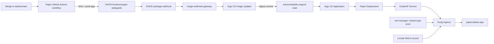

# Tadoku Paper deployment topology and touchpoints

Status: Phase 0 delivery contract

Evidence captured: 2026-08-08 UTC, from Tadoku commit `92083ac7fa3972648d154f78b4d7e398bb985502`, the live `lke20948-ctx` cluster, GitHub repository settings, GHCR manifests, public DNS/HTTPS, and `antonve/tadoku-argocd` `main` at `a4164622fb3c4fa191f3200a377061bf822f1873`.

## Executive finding

`paper.tadoku.app` is already provisioned in public DNS at `139.162.94.193`, the same Kong load-balancer address as `ui.tadoku.app`. It does not yet have a Kubernetes Ingress or trusted certificate: HTTPS reaches Kong's default self-signed `localhost` certificate and returns `404`. No DNS change is required to launch Paper.

Production workload configuration is not owned by this repository. It is reconciled from the private `antonve/tadoku-argocd` repository. A merge to Tadoku `main` currently publishes a mutable `prod` image tag; a GHCR package webhook triggers Argo CD Image Updater, which writes the resolved digest to the GitOps repository; Argo CD then auto-syncs the workload. Paper must join that path as an independent image and Argo CD Application.

## Current production evidence

| Surface | Observed state | Consequence |
| --- | --- | --- |
| `ui.tadoku.app` DNS | A record `139.162.94.193`, public TTL 21,600 seconds | Existing hostname already reaches the production Kong address. |
| `paper.tadoku.app` DNS | A record `139.162.94.193`, public TTL 21,600 seconds | Initial Paper launch needs no DNS mutation. |
| DNS authority | `ns1` through `ns5.linode.com` | Linode DNS is an out-of-repository dependency only if the record later changes or is removed. |
| `paper.tadoku.app` HTTPS | Kong default `localhost` certificate and JSON `404` | Expected pre-launch state; add Ingress and certificate before claiming readiness. |
| `ui.tadoku.app` HTTPS | Let's Encrypt certificate for `ui.tadoku.app`; `/` and `/buttons` return `200` from Next.js | Legacy catalogue and direct routes are healthy. |
| Legacy workload | `tdk-prod-styleguide/tadoku-ui`, one ready replica, zero restarts, image digest `sha256:57860cc297bdcfec1ef169cf859668379cf84e55e9cc596a683de60829cad0a7` | This exact digest is the current rollback baseline, not a permanent future baseline. Re-record it at every cutover. |
| Legacy resources | request `50m` CPU / `200Mi`; limit `250m` / `512Mi` | These Node/Next values must not be copied to the static server without measurement. |
| Legacy health | readiness `/`; liveness `/static/favicon.png`; port 3000 | Vite does not emit the same favicon path. Paper needs new exact health semantics. |
| Argo CD | `tadoku-styleguide` was `Synced Healthy` at revision `a4164622...`; auto-prune and self-heal enabled | Direct `kubectl` image edits are not durable and are not a rollback mechanism. |
| Metrics | Kubernetes Metrics API unavailable; `kubectl top` fails | Resource evidence must use local container metrics and cgroup v2 counters unless cluster metrics are added separately. |

The repository-local `frontend/apps/*/deployments` manifests are development/Tilt inputs. They are not production sources. The legacy styleguide is not present in Tilt and has no deployment manifest in the Tadoku repository.

## Target coexistence topology

Use a distinct production identity throughout Phases 1–7:

| Item | Contract |
| --- | --- |
| Workspace package | `paper-ui` |
| Workspace application | `paper-styleguide` |
| GHCR image | `ghcr.io/tadoku/tadoku/frontend-paper-styleguide` |
| Immutable build tag | full Tadoku Git commit SHA |
| Promotion tag | `prod` (mutable pointer consumed by Image Updater) |
| Argo CD Application | `tadoku-paper-styleguide` |
| Namespace | `tdk-prod-paper-styleguide` |
| Deployment / Service | `tadoku-paper-styleguide` |
| Ingress | `paper-styleguide` |
| TLS Secret | `paper-styleguide-tls` |
| Host | `paper.tadoku.app` |
| Container port | named `http`, recommended 8080 for a non-root static server |

Do not reuse `frontend-styleguide` for Paper during coexistence. A separate image prevents Paper publications from changing `ui.tadoku.app` and preserves the legacy image stream for final rollback.

## Static-serving contract

The production image must contain only the built Vite output and the static server needed to serve it. It must run as a non-root user with a read-only root filesystem and no Node/Next runtime.

The server configuration is part of the tested application artifact:

- exact `/healthz` returns a small `200` response with `Cache-Control: no-store`;
- exact `/index.html` is served with revalidation/no-cache headers;
- Vite content-hashed assets under `/assets/` use `Cache-Control: public, max-age=31536000, immutable` and return `404` when absent;
- other unversioned public assets use a short revalidation policy;
- all non-asset application routes fall back to `/index.html` with `200`;
- the fallback must not turn missing `/assets/*` paths into HTML `200` responses;
- gzip is enabled for HTML, CSS, JavaScript, JSON, SVG, and font MIME types where appropriate;
- legacy route redirects required for the final hostname are exact `308` redirects and take precedence over the SPA fallback.

Required image smoke cases are `/`, one nested foundation route, one nested component route, `/healthz`, a hashed asset, and a deliberately missing hashed asset. Test response status, content type, cache headers, and the absence of `x-powered-by: Next.js`.

## Kubernetes health and rollout contract

Paper uses a rolling Deployment with `maxUnavailable: 0` and `maxSurge: 1`.

| Probe | Target | Purpose |
| --- | --- | --- |
| Startup | `/healthz` on named port `http` | Allow Kubernetes to distinguish slow image/container startup from a dead process. |
| Readiness | `/index.html` on named port `http` | Do not route traffic unless the catalogue entry document exists. |
| Liveness | `/healthz` on named port `http` | Restart a wedged/dead server without coupling health to a favicon or route name. |

Set `runAsNonRoot`, drop all capabilities, disable privilege escalation, use `RuntimeDefault` seccomp, and document any writable `emptyDir` needed for server PID/cache files. The Phase 1 gate requires a zero-unavailable rollout, direct-route checks through the public host, a trusted `paper.tadoku.app` certificate, and the exact running image digest recorded.

## Repository touchpoints

### `tadoku/tadoku`

| Path | Required delivery change | Phase / owner |
| --- | --- | --- |
| `frontend/apps/paper-styleguide/**` | Vite app, app-local static-server config and production Dockerfile, health/static-route tests | Phase 1; Paper styleguide lane |
| `frontend/packages/paper-ui/**` | Shared build input that must trigger Paper quality and image builds | Phases 1–4; package lanes |
| `frontend/package.json`, `frontend/pnpm-workspace.yaml`, `frontend/pnpm-lock.yaml` | Workspace scripts and reproducible dependency graph | Phase 1; package/build integrator |
| `frontend/.dockerignore` | Ensure the new build context contains required workspace outputs and excludes caches | Phase 1; delivery owner |
| `.github/workflows/build-frontend-paper-styleguide.yaml` | PR quality/image-build checks and main-only GHCR publication | Phase 1; delivery owner |
| `frontend/Tiltfile` | Paper development resource and `paper-ui` live-update/package triggers | Phase 1; delivery owner |
| `frontend/apps/paper-styleguide/deployments/**` | Development-only Deployment/Service if Paper joins Tilt | Phase 1; delivery owner |
| `k8s/dev/ingress.yaml`, `k8s/dev/render_template.py`, `tilt_config.json.example` | No change by default: temporary review uses `t3-expose`; touch only if a durable dev Paper hostname is intentionally added | Optional; dev-environment owner |
| `frontend/apps/webv2/app/ui/Footer.tsx` | Currently links to `https://ui.tadoku.app`; no change during coexistence | Phase 8 only if product direction changes |
| Existing four frontend workflows | Add Paper paths only when that application migrates; retain legacy `ui` triggers until its cutover | Phases 5–8; active application owner |

Use an app-local static Dockerfile rather than changing `frontend/Dockerfile`, which is coupled to Next standalone output and is still required by four legacy images.

### `antonve/tadoku-argocd` (private, separate PR)

| Path | Required delivery change | Why it is easy to miss |
| --- | --- | --- |
| `services/paper-styleguide/{namespace,deployment,service,ingress,kustomization}.yaml` | New production Kustomize root pinned to an immutable Paper digest | This repository, not Tadoku app-local YAML, owns production. |
| `argocd/applications/paper-styleguide.yaml` | New child Application | New Applications are rejected from automated sync unless explicitly admitted by validation policy. |
| `argocd/applications/kustomization.yaml` | Include the Application | Otherwise Argo never sees it. |
| `argocd/tadoku-project.yaml` | Admit `tdk-prod-paper-styleguide` destination | AppProject currently enumerates allowed namespaces. |
| `argocd/image-updater/image-updater.yaml` | Map `tadoku-paper-styleguide` to `frontend-paper-styleguide:prod` | This is what turns later `prod` publications into digest commits. |
| `scripts/validate-manifests.sh` | Add the Paper root to `roots` and `ownership_roots`; explicitly allow automated sync if selected | The validator maintains hard-coded ownership/application lists. |
| `scripts/refactor/validate-image-updater.sh` | Add Paper to `expected_apps` | The policy currently expects exactly eleven updater refs. |
| `services/styleguide/deployment.yaml` and `kustomization.yaml` | Final `ui.tadoku.app` cutover to the already-verified Paper image | Keep the existing Service, Ingress, DNS, and certificate stable. |
| Existing styleguide updater mapping | Pause during cutover, then change from legacy image to Paper image after success | Otherwise the hourly/webhook reconciler can restore the mutable legacy `prod` target. |

The GitOps validator runs Kustomize/kubeconform and rejects duplicate resource ownership. A Paper change is incomplete unless `make validate` passes in that repository.

## Image publication and promotion

The Paper workflow must explicitly grant `contents: read` and `packages: write`, build once from the tested checkout, and produce `latest`, full Git SHA, and `prod` tags only on `main`. Pull requests build the exact production Dockerfile without pushing. Record both the SHA tag and registry digest in the gate report.

`prod` is not the rollback identity. It is a mutable notification/promotion pointer. The immutable digest written into Kustomize and observed as the pod `imageID` is the deployment identity.

Publishing `prod` causes external state change through this chain:

1. GitHub emits a container-package event.
2. `image-webhook-gateway` accepts authenticated `prod` events and serializes them.
3. Argo CD Image Updater resolves all admitted `prod` images and commits digest changes to GitOps `main`.
4. Argo CD auto-syncs healthy Applications.

The observed 2026-08-08 styleguide publication produced several consecutive GitOps digest commits within one minute. The Paper workflow must remain independent so unrelated application workflows do not publish the same Paper image.

## `ui.tadoku.app` final cutover

Do not implement the final switch as DNS movement or as two Ingress objects in different namespaces claiming the same host. Both approaches add avoidable timing and ownership races.

After admin, auth, and webv2 have passed their smoke windows:

1. Publish and verify the final Paper digest at `paper.tadoku.app`, including all legacy-route redirects.
2. Pause the legacy styleguide Image Updater mapping.
3. In one GitOps PR, change the existing `tdk-prod-styleguide/tadoku-ui` Deployment/Kustomize image from `frontend-styleguide` to that Paper digest and update Paper-specific port/probes/resources/security context.
4. Keep the existing `tadoku-ui` Service, `ui.tadoku.app` Ingress, TLS Secret, and DNS unchanged.
5. Let the Deployment perform a zero-unavailable rolling update; verify routes and the running digest.
6. After the smoke window, repoint/re-enable the styleguide updater mapping for `frontend-paper-styleguide:prod`.
7. Keep `paper.tadoku.app` as an alias during the agreed rollback window; a later PR may turn it into an exact redirect to `ui.tadoku.app` and eventually remove its Ingress/DNS record.

This is the closest available atomic hostname switch: one stable Service changes its selected pods through a Kubernetes rollout. The previous legacy image digest remains immediately deployable through the same Deployment.

## External dependencies and credential boundary

| Dependency | Current evidence | Required authority |
| --- | --- | --- |
| Tadoku GitHub repository and GHCR | Current GitHub identity has admin access; Actions currently publishes packages with `GITHUB_TOKEN`; an active repository webhook sends `package` events to the image-updater gateway | PR creation/merge and Actions `packages: write`; no new webhook is needed for the Paper package |
| Private GitOps repository | Current GitHub identity is its sole listed admin; repository has no branch protection | Separate reviewed PR; never treat a Tadoku merge as production-manifest authority |
| Production Kubernetes | `lke20948-ctx` can read and patch workloads/create Ingress; Argo CD is authoritative | Read for gates; use GitOps commits for durable mutations |
| Argo CD/Image Updater | Healthy and writing digests to GitOps `main`; webhook secret and Git credentials are cluster-managed | Update Application/updater config through GitOps; do not expose secrets |
| cert-manager | `letsencrypt-prod` successfully issued the current UI certificate | Paper Ingress annotation and working public DNS |
| Linode DNS | Paper A record already exists; no `linode-cli` was present in the environment | No launch dependency; Linode DNS credentials only for later record removal/change |
| Cluster metrics | Metrics API absent | No credential issue; use the measurement plan or separately approve metrics infrastructure |

No database, schema, API, Ory, cookie, or production application migration is involved in launching `paper.tadoku.app`.

## Delivery gates

- GHCR digest exists for the exact merged Tadoku commit.
- GitOps validation passes and rendered resources have one owner.
- Argo CD Application is `Synced Healthy` at the expected GitOps revision.
- The pod `imageID` matches the recorded Paper digest.
- `paper.tadoku.app` serves a trusted certificate and direct nested routes with `200`.
- Missing hashed assets return `404`, not SPA HTML.
- Health probes pass with zero restarts; a rolling restart retains availability.
- Cache headers, compression, and content types match the static-serving contract.
- Resource envelope passes [resource-measurement-plan.md](resource-measurement-plan.md).
- Previous digest and the updater pause/rollback PR are ready per [rollback-runbook.md](rollback-runbook.md).
