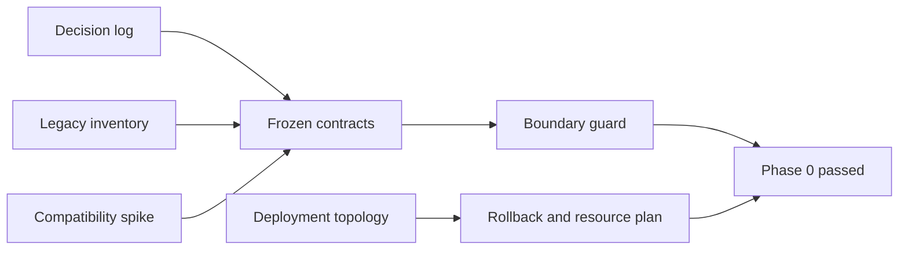

# Phase 0 gate report

Result: **passed** on 2026-08-08

Starting point: `92083ac7fa3972648d154f78b4d7e398bb985502` (`origin/main`)

## Gate evidence

| Requirement | Evidence | Result |
| --- | --- | --- |
| Indexed research packet and ADRs | `research/README.md` links every architecture decision and evidence record | Pass |
| Current-main baseline | Starting commit equals fetched `origin/main` | Pass |
| Complete legacy surface | 26 root exports, deep modules/types/config/assets, every global selector/raw recipe, and seven Headless UI-backed files inventoried | Pass |
| Consumer/content routes | Four consumer integrations, 18 legacy routes, and 39 example files mapped | Pass |
| Compatible dependency baseline | Real spike on Node 20.20.2/pnpm 10.10.0/React 18.2 passed five behavior tests, typecheck, Vite and tsup builds, SSR, package list, and strict TypeScript 4.9 declaration consumption | Pass |
| Primitive contract | Native Button/anchor plus Base UI Dialog, Menu, and Combobox DOM, keyboard, focus, form, style, type, and bundle findings recorded | Pass |
| Exact Base UI boundary | Supported component subpaths, Paper-owned wrappers/types, and an isolated TypeScript 5.9 compiler are frozen | Pass |
| Recipe/token contract | Static public CSS classes, typed helper parity, semantic token families, theme/density attributes, and Tailwind mapping policy frozen | Pass |
| Catalogue/fixture contract | Stable metadata, required 16-section sequence, deterministic fixtures, lifecycle values, canonical routes, redirect manifest, and validation failures frozen | Pass |
| Assets | Open-font license path, self-hosting rules, legacy wordmark provenance, exact Cut Meter geometry, favicon/export requirements recorded | Pass |
| Application risk/smoke matrices | Admin, auth, webv2, and Paper catalogue risks and critical flows recorded | Pass |
| Deployment and rollback | Public and private repository touchpoints, Kong/cert-manager/GHCR/Argo CD/Image Updater flow, immutable release record, and rollback runbook recorded | Pass |
| Resource measurement | Legacy baseline, cgroup/Docker method, scenarios, formulas, and acceptance thresholds recorded | Pass |
| Automated coexistence guard | `cd frontend && pnpm check:paper-boundaries` validates manifests and source boundaries from `paper-boundaries.json` | Pass |
| Contributor guidance | Coexistence and local guard instructions added without changing legacy runtime behavior | Pass |

## Frozen compatibility baseline

- React/React DOM 18.2 and Node 20 remain repository contracts.
- Paper alone uses TypeScript 5.9.3 because stable Base UI declarations cannot be parsed by TypeScript 4.9.
- Built Paper declarations must remain consumable by strict TypeScript 4.9 and may not expose Base UI types.
- Initial exact tool versions are recorded in `compatibility-matrix.md`.
- Menu pointer behavior remains a required real-browser Phase 1 smoke; its complete keyboard flow passed in jsdom.

## Operational readiness

`paper.tadoku.app` already resolves to the production Kong endpoint and needs no DNS mutation. The production launch is a separate GitOps PR in `antonve/tadoku-argocd`; current credentials can create and merge it and can inspect the `lke20948-ctx` production cluster. The first launch preserves `ui.tadoku.app` and the legacy styleguide unchanged.

No finding requires a new product or visual decision. Phase 1 may begin.

