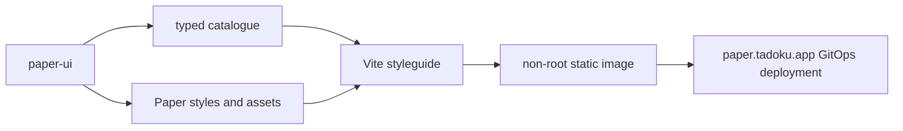

# Phase 1 pre-deployment gate

Date: 2026-08-08  
Source commit: `6fded960`  
Status: pass for merge; the separate GitOps deployment and public-host evidence remain before the Phase 1 gate is complete

## Outcome

The Paper package foundation, catalogue contract, static styleguide shell, and
production image are ready to publish. The new code has no legacy `ui`, Next,
Headless UI, or remote-font dependency. The legacy applications still build
unchanged, and the legacy styleguide remains the only owner of
`ui.tadoku.app`.

## Verification evidence

| Gate | Evidence | Result |
| --- | --- | --- |
| Boundaries | `pnpm check:paper-boundaries`; exactly one Paper stylesheet import; no private, legacy, Next, or Headless imports | Pass |
| Package quality | ESLint, strict TypeScript 5.9, 27 Vitest tests | Pass |
| Compatibility | Built declarations consumed by strict TypeScript 4.9.3 with React 18 types | Pass |
| Package output | ESM, declarations, CSS, Tailwind preset, fonts, and brand assets; 36 packed files validated | Pass |
| Styleguide quality | ESLint, strict TypeScript, 9 Vitest tests, Vite production build | Pass |
| Coexistence | Full `pnpm build` completed for Paper plus legacy admin, auth, styleguide, and webv2 | Pass |
| Static delivery | Exact Dockerfile built; `/healthz`, `/`, nested SPA fallback, gzip, immutable hashed assets, no-cache HTML, and missing-asset `404` smoke passed | Pass |
| Browser review | 1280×800 and 390×844; root/deep routes, search/filter navigation, mobile browse shell, and 360/768/1280 iframe controls | Pass |
| Fonts and brand | Browser loaded packaged favicon plus Merriweather 700 and Open Sans 400/600/700; no Google Fonts requests | Pass |
| Temporary review | `t3-expose run` URL returned `200` for `/` and `/foundations/color`; Vite honored helper-selected `HOST` and `PORT` | Pass |

The Vite output is 1,679,587 uncompressed bytes. The final local image is
21,822,659 bytes for `linux/amd64`; its runtime manifest is
`sha256:506fac13c2e52657e696ef8f00a0ec14234e0bdd55b6289b63536a00f671ebbc`.
Both Docker base images are pinned by digest.

## Initial resource evidence

Each valid run used the exact production image with a read-only root
filesystem, an 8Mi `/tmp` tmpfs, all capabilities dropped,
`no-new-privileges`, a 64Mi memory limit, and a 250m CPU limit. Each run idled
for five minutes and then served 200 sequential requests across root,
foundation, governance, and future component deep links.

| Run | Warm ready | Idle memory | After navigation | Peak memory | CPU use through idle | Navigation CPU delta | Throttling | Failures / restart / OOM |
| ---: | ---: | ---: | ---: | ---: | ---: | ---: | ---: | --- |
| 1 | 83ms | 7,864,320 B | 7,897,088 B | 10,711,040 B | 142,853µs | 44,011µs | 0 / 30 periods | 0 / 0 / 0 |
| 2 | 90ms | 7,860,224 B | 7,876,608 B | 10,620,928 B | 143,263µs | 43,701µs | 0 / 30 periods | 0 / 0 / 0 |
| 3 | 85ms | 7,868,416 B | 7,917,568 B | 10,706,944 B | 143,613µs | 43,458µs | 0 / 31 periods | 0 / 0 / 0 |

The provisional 100m CPU limit was rejected before these runs. It served all
200 requests without error but recorded four navigation throttle events. The
250m repetition eliminated throttling in every run.

| Resource | Selected | Evidence |
| --- | ---: | --- |
| CPU request | `10m` | Five-minute idle CPU remained below the measurement-plan floor. |
| CPU limit | `250m` | The 100m hypothesis throttled; 250m completed all valid runs without throttling. |
| Memory request | `32Mi` | Worst idle/navigation observation was under 7.6Mi; the formula remains below its 32Mi floor. |
| Memory limit | `64Mi` | Worst 10.22Mi peak is under 16% of the selected limit with no memory events. |

Phase 4 repeats the full idle, sustained, burst, and recovery protocol after
the catalogue and its fixture assets are complete.

## Remaining deployment gate

- Publish the merged source SHA and immutable GHCR digest.
- Merge the separately validated `antonve/tadoku-argocd` PR that adds only the
  Paper namespace, Application, workload, service, ingress/TLS, project
  destination, and image-updater admission.
- Confirm Argo CD is Synced/Healthy, the certificate is trusted, the running
  pod image ID matches the recorded registry digest, public root/deep routes
  pass, and `ui.tadoku.app` still serves the legacy digest.
- Record the production cgroup snapshot and the exact rollback identity in the
  Phase 1 deployment gate report.
